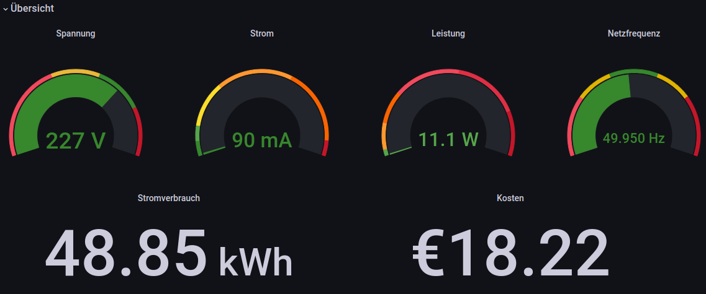

# Shelly 3EM Pro --> ESP32 --> InfluxDB

Little sketch to bring the Shelly data to a webserver without cloud connection.

- ### Shelly 3EM Pro
The Shelly should be connected to the local W-Lan network and must have a fixed IP Adress.

- ### e.g. Grafana
InfluxDB can then be used for example with Grafana, see Screenshot:

